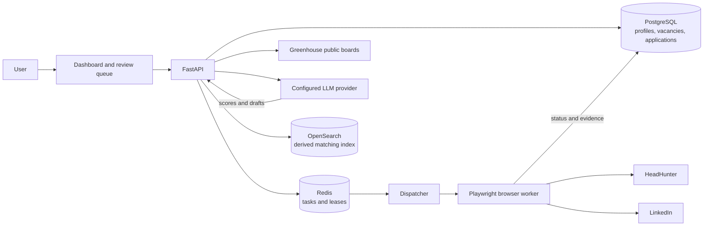

# Job Searching Assistant

[Русский](README.ru.md) | **English**

A recruitment assistant with a personal dashboard for resume analysis, vacancy discovery, candidate matching, cover-letter drafting, application review, and explicitly enabled browser submission. HeadHunter and LinkedIn search uses the user's saved browser sessions rather than job-seeker APIs.

Current stable version: **1.1.300**.

HeadHunter's changeable browser selectors and confirmation texts are stored in
`config/browser/headhunter_apply.json`. Docker Compose mounts this profile read-only into the API
and browser worker. If HeadHunter changes its response form, update the relevant selector list and
restart `api` and `browser-worker`; Python code does not need to be changed. The profile is
validated at adapter startup and an invalid or incomplete file stops the flow safely.

## Features

- Searches HeadHunter and LinkedIn through isolated Playwright browser sessions and imports public Greenhouse boards.
- Analyses multiple resumes and uses the selected resume for discovery, matching, and application materials.
- Shows discovered vacancies progressively while matching scores and cover letters are generated.
- Keeps higher-scoring vacancies at the top and filters previously rejected, submitted, or blacklisted results.
- Supports review, editing, manual continuation, audited retries, and explicit submission controls.
- Persists application state in PostgreSQL, coordinates workers through Redis, and uses OpenSearch as a rebuildable matching index.

## Architecture



PostgreSQL is the source of truth. Redis provides dispatch coordination and leases. OpenSearch contains derived matching data and can be rebuilt without losing business data. Browser sessions are stored in root-confined encrypted files; PostgreSQL keeps only their lifecycle metadata.

## Quick start with Docker Compose

### 1. Requirements

- Windows 10 or 11 with WSL 2;
- [Docker Desktop](https://www.docker.com/products/docker-desktop/) with the WSL 2 engine;
- [Git for Windows](https://git-scm.com/download/win);
- at least 8 GB RAM and 10 GB free disk space.

Optional local detailed-matching models require at least 16 GB RAM and approximately 12 GB of additional disk space.

### 2. Install and start

Open PowerShell:

```powershell
git clone https://github.com/Sa1avatus/job-searching-assistant.git
cd job-searching-assistant
powershell -NoProfile -ExecutionPolicy Bypass -File .\scripts\setup.ps1
```

The setup script creates `.env`, generates encryption material for browser sessions and saved LLM keys, builds the containers, waits for their health checks, and prints the dashboard address.

Open `http://127.0.0.1:8000/dashboard`, then:

1. Create a user in **Access**.
2. Select an LLM provider and model in **Model**.
3. Upload and analyse one or more resumes in **Resume**.
4. Sign in to hh.ru and LinkedIn in **Site sessions**.
5. Select a resume and start a search.

Never commit `.env`: it contains secrets.

### 3. Stop, restart, or update

```powershell
docker compose --profile browser stop
docker compose --profile browser up -d
```

To update an existing installation:

```powershell
git pull
powershell -NoProfile -ExecutionPolicy Bypass -File .\scripts\setup.ps1
```

Docker volumes preserve PostgreSQL, Redis, OpenSearch, and downloaded models during normal rebuilds. Do not run `docker compose down -v` unless you intentionally want to delete all local application data.

### 4. Optionally enable detailed matching

Only enable the bundled BGE models on a sufficiently powerful machine:

```powershell
powershell -NoProfile -ExecutionPolicy Bypass -File .\scripts\setup.ps1 -EnableDetailedMatching
```

The first run downloads several gigabytes. Standard browser search, resume analysis, cover letters, status management, and application review do not require these local models.

### 5. Manual start

```powershell
Copy-Item .env.example .env
# Set APP_BROWSER_STATE_ENCRYPTION_KEY in .env to a Fernet-compatible random key.
docker compose --profile browser up --build -d --wait
Invoke-RestMethod http://127.0.0.1:8000/health
```

## Dashboard and review flow

The dashboard is available at `http://127.0.0.1:8000/dashboard`; the detailed review queue is at `http://127.0.0.1:8000/review`. Set `APP_HTTP_PORT` in `.env` to use another host port.

The dashboard contains saved vacancies, search, the company blacklist, resumes, browser sessions, LLM configuration, and local access settings. Search results appear progressively. Matching and cover-letter generation continue in the background, and vacancy cards are reordered as scores become available.

Real submission is disabled by default. Set `APP_ENABLE_LINKEDIN_APPLY=true` to enable LinkedIn Easy Apply. Set `APP_ENABLE_HEADHUNTER_APPLY=true` only when final hh.ru submission should be available. CAPTCHA, SMS, 2FA, legal declarations, and unknown required questions always require human action.

## Main API routes

| Route | Purpose |
| --- | --- |
| `GET /health`, `GET /ready` | Check service health and readiness. |
| `GET /metrics` | Read application metrics. |
| `POST /v1/assessments` | Assess a vacancy against a profile. |
| `POST /v1/users` | Create a local user. |
| `GET /v1/users/{user_id}/vacancies` | List filtered and paginated saved vacancies. |
| `GET /v1/users/{user_id}/cv-files` | List uploaded resumes. |
| `POST /v1/users/{user_id}/cv-files` | Upload a validated resume. |
| `GET /v1/users/{user_id}/browser-sessions` | Inspect saved site-session state. |
| `POST /v1/vacancies/import-greenhouse` | Import a public Greenhouse vacancy. |
| `POST /v1/vacancies/import-headhunter` | Import a vacancy through the hh.ru browser session. |
| `POST /v1/vacancies/import-linkedin-reference` | Save a policy-safe LinkedIn reference. |
| `GET /v1/review-queue` | List applications awaiting review. |
| `POST /v1/applications/{application_id}/decision` | Record a review decision. |
| `POST /v1/applications/{application_id}/retry` | Retry a recoverable task with audit history. |
| `GET /v1/applications/{application_id}/match-details` | Read explainable matching evidence. |

See [`docs/commands.md`](docs/commands.md), [`docs/architecture.md`](docs/architecture.md), [`docs/security.md`](docs/security.md), [`docs/compliance-matrix.md`](docs/compliance-matrix.md), and [`docs/known-limitations.md`](docs/known-limitations.md) for the complete verified behavior.

## Local development without Docker

Python 3.12 or newer is required:

```powershell
python -m venv .venv
.\.venv\Scripts\Activate.ps1
python -m pip install -e ".[dev]"
playwright install chromium
python -m app.cli assess --profile examples/profile.json --vacancy examples/vacancy.json
```

## Verification

```powershell
python -m pytest -q
```

## Current limitations

- Real submission requires both a feature flag and explicit confirmation in the dashboard.
- LinkedIn automation can trigger platform restrictions and should only be used with an account whose risk the user accepts.
- External-site selectors may require maintenance after site redesigns.
- Scanned or image-only resumes require OCR before upload.
- Matching v2 remains in shadow mode by default and does not replace the dashboard score until its services are deliberately enabled.

## Security

- Never commit `.env`, browser-session files, credentials, API keys, or real application evidence.
- Saved LLM keys and browser state are encrypted with `APP_BROWSER_STATE_ENCRYPTION_KEY`.
- Automated tests use controlled fixtures and never submit real applications.
- Unverified profile facts, sensitive declarations, CAPTCHA, 2FA, and unknown required answers cannot be silently submitted.
