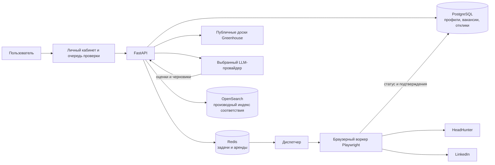

# Job Searching Assistant

**Русский** | [English](README.md)

Ассистент по поиску работы с личным кабинетом для анализа резюме, поиска вакансий, оценки соответствия, подготовки сопроводительных писем, проверки откликов и явно разрешённой отправки через браузер. Поиск на HeadHunter и LinkedIn использует сохранённые браузерные сессии пользователя, а не API для соискателей.

Текущая стабильная версия: **1.0.0**.

## Возможности

- Ищет вакансии на HeadHunter и LinkedIn через изолированные браузерные сессии Playwright и импортирует публичные доски Greenhouse.
- Анализирует несколько резюме и использует выбранное резюме для поиска, оценки и подготовки материалов.
- Показывает найденные вакансии постепенно, пока в фоне рассчитывается соответствие и создаются сопроводительные письма.
- Поднимает более подходящие вакансии выше и исключает ранее отклонённые, уже отправленные и вакансии компаний из чёрного списка.
- Поддерживает проверку, редактирование, ручное продолжение, повтор задач с аудитом и явное управление отправкой.
- Хранит состояние откликов в PostgreSQL, координирует воркеры через Redis и использует OpenSearch как восстанавливаемый индекс соответствия.

## Архитектура



PostgreSQL является источником истины. Redis координирует выполнение задач и аренды воркеров. OpenSearch хранит производные данные для оценки соответствия и может быть пересоздан без потери бизнес-данных. Браузерные сессии хранятся в зашифрованных файлах внутри разрешённого каталога; в PostgreSQL записывается только информация об их жизненном цикле.

## Быстрый запуск в Docker Compose

### 1. Требования

- Windows 10 или 11 с WSL 2;
- [Docker Desktop](https://www.docker.com/products/docker-desktop/) с движком WSL 2;
- [Git for Windows](https://git-scm.com/download/win);
- не менее 8 ГБ оперативной памяти и 10 ГБ свободного места.

Для необязательных локальных моделей детального сопоставления требуется не менее 16 ГБ оперативной памяти и около 12 ГБ дополнительного места.

### 2. Установка и запуск

Откройте PowerShell:

```powershell
git clone https://github.com/Sa1avatus/job-searching-assistant.git
cd job-searching-assistant
powershell -NoProfile -ExecutionPolicy Bypass -File .\scripts\setup.ps1
```

Сценарий настройки создаёт `.env`, генерирует ключ для браузерных сессий и сохранённых LLM-ключей, собирает контейнеры, дожидается проверки их состояния и выводит адрес личного кабинета.

Откройте `http://127.0.0.1:8000/dashboard`, затем:

1. Создайте пользователя в разделе **Доступ**.
2. Выберите LLM-провайдера и модель в разделе **Модель**.
3. Загрузите и проанализируйте одно или несколько резюме в разделе **Резюме**.
4. Войдите на hh.ru и LinkedIn в разделе **Сессии сайтов**.
5. Выберите резюме и запустите поиск.

Никогда не добавляйте `.env` в Git: файл содержит секреты.

### 3. Остановка, повторный запуск и обновление

```powershell
docker compose --profile browser stop
docker compose --profile browser up -d
```

Чтобы обновить установленное приложение:

```powershell
git pull
powershell -NoProfile -ExecutionPolicy Bypass -File .\scripts\setup.ps1
```

Тома Docker сохраняют PostgreSQL, Redis, OpenSearch и загруженные модели при обычной пересборке. Не запускайте `docker compose down -v`, если не хотите удалить все локальные данные приложения.

### 4. Необязательное детальное сопоставление

Включайте встроенные модели BGE только на достаточно мощном компьютере:

```powershell
powershell -NoProfile -ExecutionPolicy Bypass -File .\scripts\setup.ps1 -EnableDetailedMatching
```

При первом запуске загружается несколько гигабайт данных. Обычный поиск через браузер, анализ резюме, сопроводительные письма, управление статусами и проверка откликов работают без локальных моделей.

### 5. Ручной запуск

```powershell
Copy-Item .env.example .env
# Укажите в .env совместимый с Fernet случайный ключ APP_BROWSER_STATE_ENCRYPTION_KEY.
docker compose --profile browser up --build -d --wait
Invoke-RestMethod http://127.0.0.1:8000/health
```

## Личный кабинет и проверка откликов

Личный кабинет доступен по адресу `http://127.0.0.1:8000/dashboard`, подробная очередь проверки — по адресу `http://127.0.0.1:8000/review`. Чтобы изменить порт, укажите `APP_HTTP_PORT` в `.env`.

В личном кабинете находятся сохранённые вакансии, поиск, чёрный список компаний, резюме, браузерные сессии, настройка LLM и локального доступа. Результаты поиска появляются постепенно. Оценка соответствия и генерация сопроводительных писем продолжаются в фоне, а карточки вакансий перестраиваются по мере получения оценок.

Реальная отправка по умолчанию отключена. Укажите `APP_ENABLE_LINKEDIN_APPLY=true`, чтобы разрешить LinkedIn Easy Apply. Указывайте `APP_ENABLE_HEADHUNTER_APPLY=true` только если должна быть доступна финальная отправка на hh.ru. CAPTCHA, SMS, двухфакторная аутентификация, юридические декларации и неизвестные обязательные вопросы всегда требуют участия пользователя.

## Основные API-маршруты

| Маршрут | Назначение |
| --- | --- |
| `GET /health`, `GET /ready` | Проверка работоспособности и готовности сервиса. |
| `GET /metrics` | Метрики приложения. |
| `POST /v1/assessments` | Оценка вакансии относительно профиля. |
| `POST /v1/users` | Создание локального пользователя. |
| `GET /v1/users/{user_id}/vacancies` | Список сохранённых вакансий с фильтрами и пагинацией. |
| `GET /v1/users/{user_id}/cv-files` | Список загруженных резюме. |
| `POST /v1/users/{user_id}/cv-files` | Загрузка проверенного файла резюме. |
| `GET /v1/users/{user_id}/browser-sessions` | Состояние сохранённых сессий сайтов. |
| `POST /v1/vacancies/import-greenhouse` | Импорт публичной вакансии Greenhouse. |
| `POST /v1/vacancies/import-headhunter` | Импорт вакансии через браузерную сессию hh.ru. |
| `POST /v1/vacancies/import-linkedin-reference` | Сохранение безопасной ссылки на LinkedIn. |
| `GET /v1/review-queue` | Список откликов, ожидающих проверки. |
| `POST /v1/applications/{application_id}/decision` | Запись решения пользователя. |
| `POST /v1/applications/{application_id}/retry` | Повтор восстанавливаемой задачи с аудитом. |
| `GET /v1/applications/{application_id}/match-details` | Объяснение оценки соответствия. |

Полное проверенное поведение описано в [`docs/commands.md`](docs/commands.md), [`docs/architecture.md`](docs/architecture.md), [`docs/security.md`](docs/security.md), [`docs/compliance-matrix.md`](docs/compliance-matrix.md) и [`docs/known-limitations.md`](docs/known-limitations.md).

## Локальная разработка без Docker

Требуется Python 3.12 или новее:

```powershell
python -m venv .venv
.\.venv\Scripts\Activate.ps1
python -m pip install -e ".[dev]"
playwright install chromium
python -m app.cli assess --profile examples/profile.json --vacancy examples/vacancy.json
```

## Проверка проекта

```powershell
python -m pytest -q
```

## Текущие ограничения

- Реальная отправка требует одновременно включённого флага и явного подтверждения в личном кабинете.
- Автоматизация LinkedIn может привести к ограничениям со стороны платформы; используйте её только с учётной записью, риск для которой вы принимаете.
- После изменения внешних сайтов селекторы могут потребовать обновления.
- Для отсканированных резюме и документов без текстового слоя перед загрузкой требуется OCR.
- Сопоставление v2 по умолчанию работает в теневом режиме и не заменяет оценку в личном кабинете, пока его сервисы не включены явно.

## Безопасность

- Никогда не добавляйте в Git `.env`, файлы браузерных сессий, учётные данные, API-ключи и реальные подтверждения откликов.
- Сохранённые LLM-ключи и состояние браузера шифруются ключом `APP_BROWSER_STATE_ENCRYPTION_KEY`.
- Автоматические тесты используют контролируемые стенды и никогда не отправляют реальные отклики.
- Непроверенные факты профиля, чувствительные декларации, CAPTCHA, 2FA и неизвестные обязательные ответы нельзя отправить без ведома пользователя.
