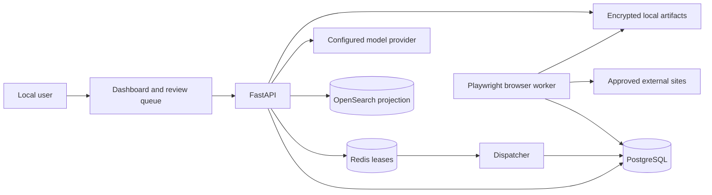

# Architecture

Read this document when changing service boundaries, cross-component data flow, worker ownership, or
runtime topology. Open the linked topic document before changing persistence, browser execution, or
matching internals.

## System shape

The application is a layered modular monolith with separate runtime workers:

PostgreSQL owns business truth and durable task history. Redis coordinates claims and execution
leases. OpenSearch contains only rebuildable matching evidence. File artifacts are root-confined;
database rows store controlled metadata and relative references.

## Layers

1. `app/domain/` owns verified facts, policy, field/value types, matching semantics, failures, and
   workflow states. It does not import FastAPI, SQLAlchemy, Playwright, Redis, or HTTP clients.
2. `app/services/` and `app/workflows/` coordinate use cases, transactions, policy decisions, and
   durable transitions through explicit collaborators.
3. `app/storage/` implements SQLAlchemy repositories and artifact storage. See `database.md`.
4. `app/browser/` implements typed Playwright actions, session state, form discovery, evidence, and
   bounded selector recovery. See `browser-automation.md`.
5. `adapters/job_boards/` owns source-specific URL validation, read behavior, and application steps.
6. `app/llm/` and `app/prompts/` provide provider-neutral model calls and validated prompt records.
7. `app/matching/` orchestrates extraction, indexing, retrieval, reranking, and deterministic
   scoring. See `matching-architecture.md`.
8. `app/api/` exposes HTTP schemas and serves `app/static/`; it composes services but should not
   become the home for domain policy.
9. `app/workers/` owns durable task dispatch, browser execution, coordination, and retention.

ADRs under `docs/adr/` record durable decisions. ADR 0001 defines the modular monolith, ADR 0002
retains official Playwright, and ADR 0003 defines the intended safe declarative workflow model.

## Durable work

Workflow tasks are persisted in SQL with a typed payload, target queue, attempt count, and transition
history. The dispatcher atomically claims ordinary work with PostgreSQL locking. A dedicated
matching worker claims the priority-aware `matching` queue with configurable job concurrency, while
browser tasks are claimed only by the browser worker. Long-running workers renew their Redis lease
and SQL claim heartbeat without holding the claim transaction open.

Before a potentially irreversible action, the workflow persists a checkpoint. Human-action states
are resumed explicitly and at most once. Retries are bounded and must first determine whether the
previous external action completed.

## Browser and generated content

Model output cannot invoke Playwright or persistence directly. It is validated into domain types;
deterministic policy then decides whether data can be stored, shown for review, or scheduled for
browser preparation. Browser state is encrypted outside PostgreSQL, and host validation fails
closed. Details and connector differences are in `browser-automation.md`.

## Resume and matching ownership

Resume-derived facts are scoped to a `cv_file`, while explicit non-resume facts remain user-scoped.
Discovery, matching, generated materials, and application document selection use the same selected
resume. Matching v2 stores explainable results in PostgreSQL and indexes verified evidence into a
tenant-filtered OpenSearch projection. Shadow mode preserves the legacy visible score until an
evaluated rollout.

## Runtime topology

Docker Compose defines PostgreSQL, Redis, OpenSearch, API, dispatcher, matching worker, retention,
an opt-in browser worker, and an opt-in GPU embedding service. API and infrastructure ports are published on
loopback. The independent reranker is configured as an external HTTP dependency and is not owned
or started by JSA Compose. The browser worker owns both background automation and the visible
local login browser used to capture site sessions (opened on an Xvfb display and exposed over
noVNC at `:7900`); the API image no longer carries browser binaries.

The shared external Docker network `local-code-worker-network` lets the application reach the local
Worker's OpenAI-compatible endpoint. `scripts/setup.ps1` ensures the network exists without
starting or configuring the Worker.

Production deployment is not defined. Do not infer production readiness from the local Compose
topology.

## Application CRM (stage 5A)

`app/services/application_crm.py` derives everything from recorded **events**: timeline
`status_change` and `email_received` rows, the submission ledger (`confirmed`, non-legacy) and the
current status as a fallback for legacy rows. `manual_update` timeline rows are human matching
feedback (labels for the ranker), never outcomes, and are ignored. Model scores are not used to
compute any outcome; the production score band and the scoring version appear only as grouping
dimensions.

- **Journey.** `GET /v1/users/{id}/crm/applications/{aid}/journey`: saved -> submitted -> responded ->
  interview -> offer, each with `reached`, the first timestamp and the evidence, plus the outcome
  (`offer`, `employer_rejected`, `withdrawn`, `rejected`, `skipped`, `open`). A response means an
  employer email or a decision status (interview/offer/employer_rejected); a manual pre-submission
  `approved` is not a response.
- **Funnel.** `GET /v1/users/{id}/crm/funnel?group_by=source|company|resume|role|score_band|strategy`
  returns per group: applications, submitted, mature submitted, pending, and response / interview /
  offer / rejection rates. Rates use only **mature** submissions (sent >= 14 days ago, or already
  answered), so recent applications do not deflate them, each with n and a 95 % Wilson interval;
  groups under 10 mature submissions are `low_sample`.
- **Insights.** `GET /v1/users/{id}/crm/insights` compares the best and worst group per dimension,
  only among groups with enough data, and states whether the intervals overlap. It is descriptive: it
  never recommends an action and says so.
- **Immutability.** Timeline events are an append-only audit log: an ORM update or delete raises
  `ImmutableTimelineEvent`; corrections are new events.
- **Ownership.** Every endpoint is scoped to the user; another user's application is a 404.
- **Dashboard.** Panel "Аналитика откликов" (`?panel=crm`).

On the real database (134 submitted applications) this yields a 3 % response rate (95 % interval
1.2-7.4 %) and one interview - a sparse signal, which is exactly why intervals and the low-sample flag
are shown.

## Closed-loop job strategy (stage 5B)

`app/services/job_strategy.py` closes the loop search -> match -> apply -> outcome -> learning ->
strategy. It reads the CRM funnels and proposes changes; the user decides.

- **Evidence gate.** A recommendation exists only when at least 30 matured submissions exist overall
  and two groups of one dimension (resume, source, role, score band) each have 10+ matured submissions
  with **non-overlapping** 95 % Wilson intervals. Otherwise `POST .../strategy/recommendations/generate`
  returns no recommendation and `no_recommendation_because` lists exactly what is missing (too few
  submissions, too few comparable groups, overlapping intervals).
- **Explainable.** Each recommendation stores its statement, evidence (best/worst group, successes, n,
  rate, interval), `causal: false` and the confounders to keep in mind (different resumes went to
  different vacancies, sources differ in mix, ...).
- **Human approval.** Generating changes nothing. `POST .../recommendations/{id}/decision` with
  `accept` applies at most one narrow, reversible action - switching the active resume when the
  recommended file is unambiguous - or, for advice, records that the user adopted it and changes no
  setting. `reject` is remembered and the same recommendation is not proposed again. A decision is
  final (409 afterwards) and every decision, with its note, baseline and result, is kept in
  `strategy_recommendations` (migration 0047) as the audit trail.
- **Follow-up.** `GET .../recommendations/{id}/followup` compares the response rate of matured
  submissions before and after the decision. It says `too_early` until 10 matured submissions exist
  after the decision, and never claims causality even when the difference is real.
- **Ownership.** All endpoints are scoped to the user; another user's recommendation is a 404.

With the current real history (134 submitted, ~3 % answered) the gate produces **no**
recommendation, which is the intended, honest outcome: there is not yet enough signal to steer on.
