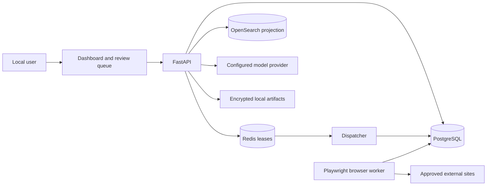

# Architecture

Read this document when changing service boundaries, cross-component data flow, worker ownership, or
runtime topology. Open the linked topic document before changing persistence, browser execution, or
matching internals.

## System shape

The application is a layered modular monolith with separate runtime workers:

PostgreSQL owns business truth and durable task history. Redis coordinates claims and execution
leases. OpenSearch contains only rebuildable matching evidence. File artifacts are root-confined;
database rows store controlled metadata and relative references.

## Layers

1. `app/domain/` owns verified facts, policy, field/value types, matching semantics, failures, and
   workflow states. It does not import FastAPI, SQLAlchemy, Playwright, Redis, or HTTP clients.
2. `app/services/` and `app/workflows/` coordinate use cases, transactions, policy decisions, and
   durable transitions through explicit collaborators.
3. `app/storage/` implements SQLAlchemy repositories and artifact storage. See `database.md`.
4. `app/browser/` implements typed Playwright actions, session state, form discovery, evidence, and
   bounded selector recovery. See `browser-automation.md`.
5. `adapters/job_boards/` owns source-specific URL validation, read behavior, and application steps.
6. `app/llm/` and `app/prompts/` provide provider-neutral model calls and validated prompt records.
7. `app/matching/` orchestrates extraction, indexing, retrieval, reranking, and deterministic
   scoring. See `matching-architecture.md`.
8. `app/api/` exposes HTTP schemas and serves `app/static/`; it composes services but should not
   become the home for domain policy.
9. `app/workers/` owns durable task dispatch, browser execution, coordination, and retention.

ADRs under `docs/adr/` record durable decisions. ADR 0001 defines the modular monolith, ADR 0002
retains official Playwright, and ADR 0003 defines the intended safe declarative workflow model.

## Durable work

Workflow tasks are persisted in SQL with a typed payload, target queue, attempt count, and transition
history. The dispatcher atomically claims ordinary work with PostgreSQL locking. A dedicated
matching worker claims the priority-aware `matching` queue with configurable job concurrency, while
browser tasks are claimed only by the browser worker. Long-running workers renew their Redis lease
and SQL claim heartbeat without holding the claim transaction open.

Before a potentially irreversible action, the workflow persists a checkpoint. Human-action states
are resumed explicitly and at most once. Retries are bounded and must first determine whether the
previous external action completed.

## Browser and generated content

Model output cannot invoke Playwright or persistence directly. It is validated into domain types;
deterministic policy then decides whether data can be stored, shown for review, or scheduled for
browser preparation. Browser state is encrypted outside PostgreSQL, and host validation fails
closed. Details and connector differences are in `browser-automation.md`.

## Resume and matching ownership

Resume-derived facts are scoped to a `cv_file`, while explicit non-resume facts remain user-scoped.
Discovery, matching, generated materials, and application document selection use the same selected
resume. Matching v2 stores explainable results in PostgreSQL and indexes verified evidence into a
tenant-filtered OpenSearch projection. Shadow mode preserves the legacy visible score until an
evaluated rollout.

## Runtime topology

Docker Compose defines PostgreSQL, Redis, OpenSearch, API, dispatcher, matching worker, retention,
an opt-in browser worker, and an opt-in GPU embedding service. API and infrastructure ports are published on
loopback. The independent reranker is configured as an external HTTP dependency and is not owned
or started by JSA Compose. The API image includes the visible local browser used to capture site
sessions; the browser worker owns background automation.

The shared external Docker network `local-code-worker-network` lets the application reach the local
Worker's OpenAI-compatible endpoint. `scripts/setup.ps1` ensures the network exists without
starting or configuring the Worker.

Production deployment is not defined. Do not infer production readiness from the local Compose
topology.
