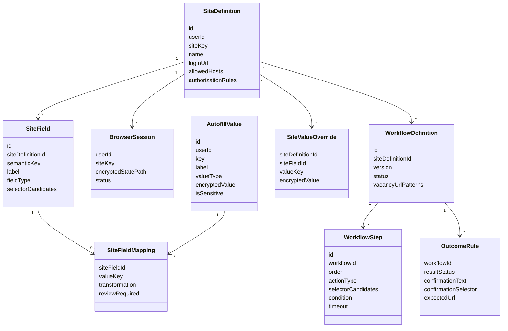
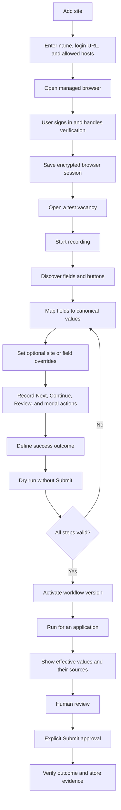

# Execution plan: universal site sessions, autofill, and visual workflows

## Goal

Extend the existing “Site sessions” area so a user can add an arbitrary job site, sign in through
the managed browser, inspect and map application fields, record and edit deterministic browser
steps, test the workflow without submitting, and explicitly approve the final submission.

Common autofill data must be stored once and reused across sites. A site may override a common
value globally, for one mapped field, or for one application.

## Handoff baseline

- Repository: `D:\OpenAIProjects\job-seaching-assistant-mvp\job-seaching-assistant`
- Branch at handoff: `feature/progressive-search-v1.1`
- Latest pushed commit: `12fa95a` (`release: version 1.1.100`)
- Remote branch: `origin/feature/progressive-search-v1.1`
- The release commit was pushed on 2026-07-29.
- Full verification before that commit: `366 passed`.
- API version running after the release rebuild: `1.1.100`.

### Uncommitted change that must not be lost

`adapters/job_boards/linkedin_browser.py` contains an uncommitted fix for:

```text
LinkedIn: Locator.get_attribute: Timeout 30000ms exceeded
waiting for locator("[data-job-id]").nth(4)
```

The fix replaces sequential access to virtualized `nth(...)` cards with one `evaluate_all` DOM
snapshot for job cards and fallback links. Relevant verification already passed:

```text
python -m pytest tests/unit/test_linkedin_browser.py tests/unit/test_job_discovery.py -q
28 passed
```

Before creating or switching branches, preserve this change explicitly: commit it, stash it, or
create the new branch from the current working tree. Never discard it with reset or checkout.

## Current architecture

- `BrowserSessionRow.site_key` is already stored as a string and has a unique
  `(user_id, site_key)` constraint.
- API contracts and dashboard rendering still hard-code HeadHunter and LinkedIn.
- `BrowserSiteKey`, authorization URLs, live-session probes, and UI cards are fixed to known sites.
- Playwright is the browser runtime.
- Browser state is stored outside PostgreSQL with authenticated encryption.
- `app/browser/form_discovery.py` already discovers accessible labels, HTML field types,
  constraints, options, and semantic categories.
- `app/browser/selector_library.py` already stores versioned locator candidates.
- `app/workers/browser_worker.py` and `app/workers/browser_tasks.py` provide isolated browser
  execution.
- HeadHunter has an externalized apply selector profile in
  `config/browser/headhunter_apply.json`.

## Accepted product decisions

### Navigation

Rename the existing “Access” tab to **“Profile and access”** (`Профиль и доступ`).

Its internal sections should be:

1. Personal data.
2. Application defaults.
3. Sensitive data and review rules.
4. Technical/API access.

Keep site authorization and site-specific field mappings under **“Site sessions”**.

### Autofill data

Store canonical values once:

```text
identity.full_name
identity.first_name
identity.last_name
contact.email
contact.phone
contact.linkedin_url
location.country
location.city
job_preferences.expected_salary
job_preferences.currency
job_preferences.notice_period
job_preferences.relocation_ready
custom.*
```

Keep resume-scoped data on the selected CV and generated values on the application:

```text
resume.file
resume.skills
resume.experience_summary
generated.cover_letter
vacancy.title
vacancy.company
```

Resolve effective values in this order:

1. One-time application override.
2. Override for a specific site field.
3. Override for a canonical value on a site.
4. Selected-resume value.
5. Global user value.
6. Generated value.
7. Manual input.

### Recording and execution

- Use a custom recorder on top of the existing Playwright runtime.
- Store a declarative, versioned workflow rather than generated Python or arbitrary JavaScript.
- Prefer semantic locators: role/name, label, test id, stable name/id, then bounded CSS fallback.
- Record value sources, not the literal personal value entered during recording.
- Provide a visual step editor and a test run that stops before final submission.
- Use Playwright traces, screenshots, and structured step results for diagnostics.
- Chrome DevTools Recorder JSON may be supported later as an import format.
- LLM may suggest semantic field mappings or locator repairs, but it must never execute browser
  actions directly.

### Safety

- Every site definition has an explicit HTTPS host allowlist.
- Cross-host navigation fails closed unless the new host is separately approved.
- Passwords and one-time codes are never stored as autofill values.
- CAPTCHA always requires human action.
- Sensitive answers are encrypted if the user explicitly elects to store them.
- Sensitive values are never sent to the LLM.
- `submit` is a separate privileged step and requires human confirmation by default.
- A new or modified workflow must pass a dry run before activation.
- Arbitrary JavaScript steps are forbidden.
- Automated tests never submit a real application.

## Recommended domain model



## User interaction



## Scope for the first release

- Dynamic user-defined sites and encrypted sessions.
- Ordinary input, textarea, select, checkbox, radio, and file controls.
- Linear multi-step forms.
- `navigate`, `fill`, `upload`, `select`, `check`, `click`, `wait`, `assert`,
  `human_review`, and `submit` step types.
- Canonical values, custom values, resume values, generated values, and scoped overrides.
- Visual field mapping and linear step editing.
- Dry run that cannot execute `submit`.
- Versioned workflows with draft, testing, active, broken, and archived states.
- Screenshots, structured action results, and trace references.

## Non-goals for the first release

- CAPTCHA solving.
- Password collection.
- Arbitrary JavaScript execution.
- Autonomous LLM browser control.
- Unapproved cross-domain redirects.
- Complex loops or an unrestricted programming language.
- Cross-origin iframe automation.
- Shadow DOM authoring unless a real supported site requires it.
- Fully autonomous final submission.

## External Local Code Worker workflow

The user explicitly requires implementation to be delegated to the configured external Local Code
Worker. Do not implement this feature as one large direct edit.

Before the first generation in the new session:

1. Re-read workspace and project `AGENTS.md` files.
2. Re-read the Local Code Worker task schema.
3. Run `check-connection` from `D:\OpenAIProjects\local-code-worker`.
4. Never read or expose `local-code-worker\.env`.
5. Use the provider and model configured by that environment.

Every Worker task must be a small, mechanically verifiable unit:

- Prefer one function, one model, one migration, or one API operation.
- Never ask the Worker to rewrite a whole module.
- Put only the exact writable files in `allowed_files`.
- Put interfaces and supporting architecture in `readonly_files`.
- Describe every function’s inputs, outputs, errors, invariants, side effects, security rules, and
  test cases.
- Include exact required identifiers and explicit forbidden behavior.
- Validate the task before generation.
- Review the proposal and file list before applying it.
- Apply only after the required user confirmation defined by the active workspace/project rules.
- If a proposal fails, reduce or clarify the contract rather than expanding the prompt.

Example task contract:

```text
Objective:
Implement resolve_effective_autofill_value().

Inputs:
- user_id
- site_definition_id
- site_field_id
- application_id
- cv_file_id

Output:
- typed resolved value
- source scope
- source record id
- requires_review

Precedence:
application override
> site-field override
> site-value override
> selected resume
> global value
> generated value

Forbidden:
- browser access
- database writes
- password resolution
- returning sensitive data without permission

Tests:
- one test per precedence level
- conflict precedence test
- missing-value test
- sensitive-value test
```

## Small-task implementation sequence

### Phase 0 — baseline and documentation

- [ ] Preserve or commit the uncommitted LinkedIn DOM snapshot fix.
- [ ] Create a feature branch from `feature/progressive-search-v1.1`.
- [ ] Run the full baseline test suite.
- [ ] Add an ADR for declarative workflows and canonical autofill values.

### Phase 1 — canonical profile values

- [ ] Add the typed autofill value enum.
- [ ] Add one database table and migration for canonical values.
- [ ] Add encryption and validation helpers for one stored value.
- [ ] Implement create, read, update, and delete service functions separately.
- [ ] Implement custom keys under a controlled `custom.*` namespace.
- [ ] Rename the dashboard tab to “Profile and access”.
- [ ] Add personal-data UI one subsection at a time.
- [ ] Add application-default UI one subsection at a time.
- [ ] Add sensitive-data review rules separately.

### Phase 2 — arbitrary site definitions and sessions

- [ ] Add `SiteDefinitionRow` and migration.
- [ ] Add strict URL and host validation.
- [ ] Implement create/read/update/archive service functions separately.
- [ ] Generalize authorization manager inputs without removing known-site adapters.
- [ ] Generalize browser-session status listing.
- [ ] Add one API operation at a time.
- [ ] Replace fixed dashboard cards with dynamic rendering.
- [ ] Preserve HeadHunter and LinkedIn compatibility.

### Phase 3 — fields, mappings, and overrides

- [ ] Add site-field persistence.
- [ ] Add site-field mapping persistence.
- [ ] Add site and field override persistence.
- [ ] Implement effective-value resolution as a pure, independently tested service.
- [ ] Extend form discovery to produce multiple locator candidates.
- [ ] Add the mapping table UI.
- [ ] Add “use common value / override” controls.
- [ ] Display the effective value and its source.

### Phase 4 — declarative workflows

- [ ] Define a closed enum of workflow step types.
- [ ] Add workflow and step tables and migrations.
- [ ] Add Pydantic schemas for one step type at a time.
- [ ] Implement validation for host, selector, timeout, and privileged actions.
- [ ] Implement one deterministic executor function per step type.
- [ ] Add outcome rules and result verification.
- [ ] Add version activation and rollback.

### Phase 5 — recorder and visual editor

- [ ] Add a recorder session lifecycle.
- [ ] Add a safe page overlay and element picker.
- [ ] Record clicks without literal secrets.
- [ ] Record fill/select/check/upload intents.
- [ ] Convert recorded controls into semantic mappings.
- [ ] Add the linear visual step list.
- [ ] Add reorder, disable, delete, re-record, and test-step operations.
- [ ] Add LLM suggestions only after deterministic recording works.

### Phase 6 — dry run and controlled execution

- [ ] Implement dry run with `submit` blocked by policy.
- [ ] Show every effective field value and source before execution.
- [ ] Persist screenshots and structured step evidence.
- [ ] Add explicit human approval for `submit`.
- [ ] Verify final result using text, selector, and URL rules.
- [ ] Mark workflow broken after bounded deterministic failures.

### Phase 7 — compatibility migration

- [ ] Represent existing HeadHunter behavior with the new primitives where practical.
- [ ] Represent existing LinkedIn behavior with the new primitives where practical.
- [ ] Keep specialized adapter escape hatches for genuinely non-generic behavior.
- [ ] Remove fixed-site UI paths only after compatibility tests pass.

## Verification

For every small task:

- Targeted unit tests for the new function or model.
- Ruff on changed Python files.
- `git diff --check`.
- Schema and migration validation when persistence changes.

At phase boundaries:

- `python -m pytest -q`.
- API contract tests.
- Browser tests against local controlled fixtures.
- Dry-run test proving `submit` cannot execute.
- Restart test proving sessions and workflow versions survive container recreation.
- Manual visible-browser test for a user-owned test form before claiming external compatibility.

## Risks and compatibility

- Generic workflows can accidentally broaden the trusted host surface; host validation must be a
  domain rule, not a UI convention.
- Stored values can contain personal data; encryption, redaction, retention, and export/delete
  behavior must be designed before persistence.
- Browser pages change frequently; keep multiple versioned semantic locator candidates.
- Recording literal values can leak secrets; convert recorded values into source references.
- Existing HeadHunter and LinkedIn paths must continue working during migration.
- A universal workflow language can become unsafe if it grows arbitrary scripting features; keep
  a closed set of typed actions.
- UI work should not precede the domain model and service contracts.

## Progress notes

- 2026-07-30: planning completed; implementation has not started.
- 2026-07-30: user selected “Profile and access” for common personal/default data.
- 2026-07-30: user required external Worker delegation in small function-level tasks.

## Final result

Not implemented yet. This document is the handoff source of truth for the next branch/chat.
